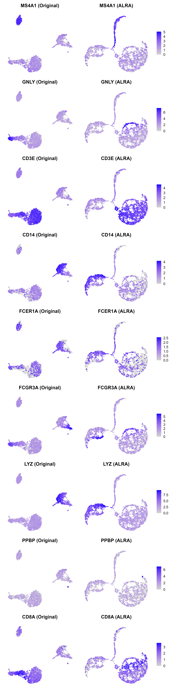

# Adaptively-thresholded Low Rank Approximation (ALRA)

ALRA provides zero-preserving low-rank completion for single-cell RNA-seq count matrices. The package exposes the core `alra()` pipeline, utilities for rank selection and normalisation, and seamless integration with modern Seurat workflows.

## Key Features
- **Zero-preserving matrix completion** using randomized SVD and adaptive thresholding.
- **Automatic rank heuristics** via `choose_k()` to pick an informative latent dimension.
- **Convenience normalisation** with `normalize_data()` for library-size scaling and log conversion.
- **Optional MKL acceleration** by enabling `use.mkl = TRUE` when the [`fastRPCA`](https://github.com/KlugerLab/rpca-mkl) backend is installed.

## Installation

ALRA targets R \>= 4.1 and requires the `Matrix`, `rsvd`, and `SeuratObject` packages. To install the development version from this repository:

```r
# install.packages("remotes")  # if remotes is missing
remotes::install_github("hk20013106/ALRA", dependencies = TRUE)
```

For Windows users leveraging MKL acceleration, install `fastRPCA` before calling `alra()` with `use.mkl = TRUE`:

```r
remotes::install_github("KlugerLab/rpca-mkl/fastRPCA")
```

After installation, load the package as usual:

```r
library(ALRA)
```

## Quick Start: Core Workflow

1. **Prepare a genes-by-cells matrix.** ALRA expects rows = genes, columns = cells.
2. **Normalise the matrix.** Use `Seurat::NormalizeData` or a custom method.
3. **Select rank `k`.** Call `choose_k()` for an automated heuristic or pass a fixed value.
4. **Run ALRA.** Execute `alra()` and extract the completed matrix (`[[3]]`).

```r
library(ALRA)
library(Seurat)

# Assume pbmc is a Seurat object with raw counts
pbmc <- NormalizeData(pbmc, verbose = FALSE)
A_norm <- as.matrix(GetAssayData(pbmc, slot = "data"))

k_choice <- choose_k(A_norm)
result <- alra(A_norm, k = k_choice$k)
completed_matrix <- result[[3]]
```

`completed_matrix` preserves the original dimensionality while imputing low-abundance transcripts in a zero-aware manner.

## Seurat Integration Example with pbmc3k

This example demonstrates a full workflow: loading the `pbmc3k` dataset, running a standard Seurat analysis, performing ALRA imputation, and visualizing the results side-by-side.

The complete, runnable code for this analysis is available in the `full_analysis_example.R` script.

```r
#
# This script demonstrates a full analysis pipeline comparing original data
# with ALRA-imputed data using the pbmc3k dataset from SeuratData.
#

# 1. Load necessary packages
if (!requireNamespace("Seurat", quietly = TRUE)) install.packages("Seurat")
if (!requireNamespace("SeuratData", quietly = TRUE)) install.packages("SeuratData")
if (!requireNamespace("patchwork", quietly = TRUE)) install.packages("patchwork")
if (!requireNamespace("remotes", quietly = TRUE)) install.packages("remotes")
if (!requireNamespace("ALRA", quietly = TRUE)) remotes::install_github("hk20013106/ALRA")

library(Seurat)
library(SeuratData)
library(ALRA)
library(patchwork)
library(ggplot2)

# 2. Load and prepare pbmc3k dataset
if (!"pbmc3k" %in% installed.packages()) {
  InstallData("pbmc3k")
}
data("pbmc3k")
pbmc3k <- UpdateSeuratObject(pbmc3k)

# 3. Perform ALRA imputation
pbmc3k <- NormalizeData(pbmc3k, verbose = FALSE)
A_norm <- as.matrix(GetAssayData(pbmc3k, layer = "data"))

# Run ALRA and create a new assay
alra_results <- alra(A_norm)
imputed_matrix <- alra_results[[3]]
rownames(imputed_matrix) <- rownames(A_norm)
colnames(imputed_matrix) <- colnames(A_norm)
pbmc3k[["alra"]] <- CreateAssayObject(counts = imputed_matrix)

cat("ALRA imputation complete.\n")

# 4. Standard analysis on original data
DefaultAssay(pbmc3k) <- "RNA"
pbmc3k <- FindVariableFeatures(pbmc3k, verbose = FALSE)
pbmc3k <- ScaleData(pbmc3k, verbose = FALSE)
pbmc3k <- RunPCA(pbmc3k, verbose = FALSE)
pbmc3k <- FindNeighbors(pbmc3k, dims = 1:10, verbose = FALSE)
pbmc3k <- FindClusters(pbmc3k, resolution = 0.5, verbose = FALSE)
pbmc3k <- RunUMAP(pbmc3k, dims = 1:10, verbose = FALSE, reduction.name = "umap.rna")

cat("Analysis on original data complete.\n")

# 5. Standard analysis on ALRA-imputed data
DefaultAssay(pbmc3k) <- "alra"
# The data is already imputed and normalized. We scale all genes.
all.genes <- rownames(pbmc3k)
pbmc3k <- ScaleData(pbmc3k, features = all.genes, verbose = FALSE)
pbmc3k <- RunPCA(pbmc3k, features = all.genes, verbose = FALSE, reduction.name = "pca.alra")
pbmc3k <- FindNeighbors(pbmc3k, dims = 1:10, reduction = "pca.alra", verbose = FALSE)
pbmc3k <- FindClusters(pbmc3k, resolution = 0.5, verbose = FALSE, cluster.name = "alra_clusters")
pbmc3k <- RunUMAP(pbmc3k, reduction = "pca.alra", dims = 1:10, verbose = FALSE, reduction.name = "umap.alra")

cat("Analysis on ALRA-imputed data complete.\n")

# 6. Generate and save side-by-side comparison plots for each marker
markers_to_plot <- c("MS4A1", "GNLY", "CD3E", "CD14", "FCER1A", "FCGR3A", "LYZ", "PPBP", "CD8A")

# Create a list to hold the plot pairs
plot_pairs <- list()

for (gene in markers_to_plot) {
  # Plot for original data
  p_rna <- FeaturePlot(
    pbmc3k,
    features = gene,
    reduction = "umap.rna",
    order = TRUE
  ) + 
  NoLegend() + 
  NoAxes() +
  ggtitle(paste(gene, "(Original)"))

  # Plot for ALRA data
  p_alra <- FeaturePlot(
    pbmc3k,
    features = gene,
    reduction = "umap.alra",
    order = TRUE
  ) + 
  NoAxes() +
  ggtitle(paste(gene, "(ALRA)"))
  # Set default assay to alra for this plot
  p_alra$data$alra <- GetAssayData(pbmc3k, assay = "alra", layer = "data")[gene, rownames(p_alra$data)]
  
  # Combine the pair side-by-side
  plot_pairs[[gene]] <- p_rna | p_alra
}

# Arrange all pairs in a single column and save
combined_figure <- wrap_plots(plot_pairs, ncol = 1)
ggsave("alra_marker_comparison.png", plot = combined_figure, width = 8, height = 32, dpi = 300, limitsize = FALSE)

cat("Comparison plot saved to alra_marker_comparison.png\n")
```

### Visual Comparison of Original vs. ALRA Imputed Data

After running the analysis, we can generate `FeaturePlots` to compare the expression of key marker genes on the UMAP projections derived from both the original and the ALRA-imputed data. The figure below shows that ALRA effectively enhances the expression signal of marker genes, making cell type-specific patterns more distinct.



*Figure: Side-by-side FeaturePlots for canonical marker genes. The left plot of each pair shows expression on the UMAP from the original RNA data. The right plot shows expression on the UMAP from the ALRA-imputed data. ALRA clarifies the expression patterns for markers like MS4A1 (B cells) and GNLY (NK cells), which are sparse in the original data.*


## Testing and Reproducibility

Developers can run the included unit tests (requires `pkgload`, `testthat`, `Seurat`, and `SeuratObject`):

```r
pkgload::load_all(export_all = FALSE, helpers = FALSE, quiet = TRUE)
testthat::test_dir("tests/testthat", reporter = "summary")
```

Set a random seed before calling `alra()` to mirror published results, as the randomized SVD initialisation introduces stochasticity:

```r
set.seed(42)
```

## Troubleshooting

- **`fastRPCA` missing**: install via GitHub or run with `use.mkl = FALSE` (default) to use the pure R backend.
- **Layer vs. slot errors**: Ensure your Seurat objects are updated to the v5 structure using `UpdateSeuratObject()`.

## Citation

If you use ALRA in your research, please cite the accompanying preprint: *Zero-preserving imputation of scRNA-seq data using low-rank approximation* (Linderman et al., bioRxiv 2018).

## License

ALRA is distributed under the MIT license. See `LICENSE.txt` for details.
