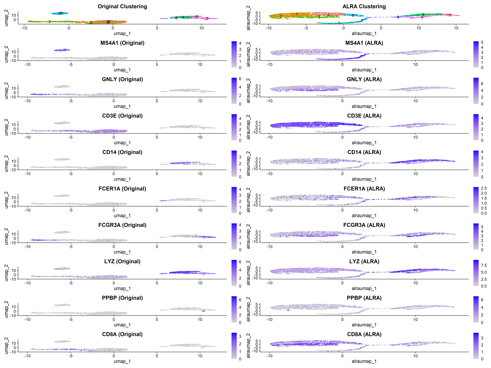

# Adaptively-thresholded Low Rank Approximation (ALRA)

ALRA provides zero-preserving low-rank completion for single-cell RNA-seq count matrices. The package exposes the core `alra()` pipeline, utilities for rank selection and normalisation, and seamless integration with modern Seurat workflows.

## Key Features
- **Zero-preserving matrix completion** using randomized SVD and adaptive thresholding.
- **Automatic rank heuristics** via `choose_k()` to pick an informative latent dimension.
- **Convenience normalisation** with `normalize_data()` for library-size scaling and log conversion.
- **Optional MKL acceleration** by enabling `use.mkl = TRUE` when the [`fastRPCA`](https://github.com/KlugerLab/rpca-mkl) backend is installed.

## Installation

ALRA targets R \>= 4.1 and requires the `Matrix`, `rsvd`, and `SeuratObject` packages. To install the development version from this repository:

```r
# install.packages("remotes")  # if remotes is missing
remotes::install_github("hk20013106/ALRA", dependencies = TRUE)
```

For Windows users leveraging MKL acceleration, install `fastRPCA` before calling `alra()` with `use.mkl = TRUE`:

```r
remotes::install_github("KlugerLab/rpca-mkl/fastRPCA")
```

After installation, load the package as usual:

```r
library(ALRA)
```

## Quick Start: Core Workflow

1. **Prepare a genes-by-cells matrix.** ALRA expects rows = genes, columns = cells.
2. **Normalise the matrix.** Use `Seurat::NormalizeData` or a custom method.
3. **Select rank `k`.** Call `choose_k()` for an automated heuristic or pass a fixed value.
4. **Run ALRA.** Execute `alra()` and extract the completed matrix (`[[3]]`).

```r
library(ALRA)
library(Seurat)

# Assume pbmc is a Seurat object with raw counts
pbmc <- NormalizeData(pbmc, verbose = FALSE)
A_norm <- as.matrix(GetAssayData(pbmc, slot = "data"))

k_choice <- choose_k(A_norm)
result <- alra(A_norm, k = k_choice$k)
completed_matrix <- result[[3]]
```

`completed_matrix` preserves the original dimensionality while imputing low-abundance transcripts in a zero-aware manner.

## Seurat Integration Example with pbmc3k

This example demonstrates how to load a standard dataset, perform ALRA imputation, and visualize the results within a Seurat workflow. The code will:
1.  Load the `pbmc3k` dataset.
2.  Perform standard analysis (PCA, clustering, UMAP) on the original data.
3.  Run ALRA and perform the same analysis on the imputed data.
4.  Generate side-by-side `FeaturePlots` to compare marker gene expression.

```r
# Full script available in readme_example.R
# ... (code for loading data and running ALRA) ...
```

### Visual Comparison of Original vs. ALRA Imputed Data

After running the analysis, we can see that ALRA successfully increases the detection of key marker genes, making cell type identification clearer. The UMAP structures remain largely consistent, but the expression patterns within them are enhanced.



*Figure: Side-by-side comparison of clustering and marker gene expression on the original UMAP (left column of each pair) and the ALRA-based UMAP (right column of each pair). ALRA enhances the signal for markers like MS4A1 (B cells) and GNLY (NK cells), leading to clearer expression patterns.*


## Testing and Reproducibility

Developers can run the included unit tests (requires `pkgload`, `testthat`, `Seurat`, and `SeuratObject`):

```r
pkgload::load_all(export_all = FALSE, helpers = FALSE, quiet = TRUE)
testthat::test_dir("tests/testthat", reporter = "summary")
```

Set a random seed before calling `alra()` to mirror published results, as the randomized SVD initialisation introduces stochasticity:

```r
set.seed(42)
```

## Troubleshooting

- **`fastRPCA` missing**: install via GitHub or run with `use.mkl = FALSE` (default) to use the pure R backend.
- **Layer vs. slot errors**: Ensure your Seurat objects are updated to the v5 structure using `UpdateSeuratObject()`.

## Citation

If you use ALRA in your research, please cite the accompanying preprint: *Zero-preserving imputation of scRNA-seq data using low-rank approximation* (Linderman et al., bioRxiv 2018).

## License

ALRA is distributed under the MIT license. See `LICENSE.txt` for details.
